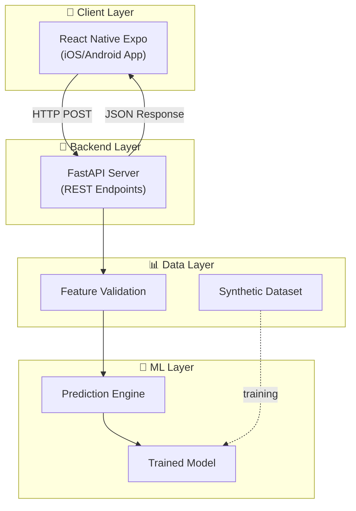

# UltraViab Architecture

> **Real-time organ viability assessment using ultrasound-derived features and machine learning**  
> **Platform**: Mobile App (React Native Expo)

---

## System Overview



---

## Client Architecture

### Mobile App (React Native Expo)

React Native Expo will serve as the primary and only user interface for the hackathon MVP. It will handle data input, display assessment results, and manage history.

```
┌─────────────────────────────────────────────────────────────────┐
│                     MOBILE ARCHITECTURE                         │
├─────────────────────────────────────────────────────────────────┤
│                                                                 │
│  📱 React Native Expo (Mobile)                                  │
│  ─────────────────────────────                                  │
│  • Touch-optimized UI                                           │
│  • Camera/sensor integration (Future)                           │
│  • Local Storage (Assessment History)                           │
│  • Real-time validation                                         │
│                                                                 │
│                    Calls ↓                                      │
│                                                                 │
│              ┌─────────────────────────┐                       │
│              │  FastAPI Backend        │                       │
│              │  (ML Prediction API)    │                       │
│              └─────────────────────────┘                       │
│                                                                 │
└─────────────────────────────────────────────────────────────────┘
```

---

## Data Layer

### Ultrasound-Derived Features
| Feature | Unit | Description |
|---------|------|-------------|
| Tissue Stiffness | kPa | Young's modulus via shear wave elastography |
| Resistive Index (RI) | dimensionless | Doppler-derived vascular resistance |
| Shear Wave Velocity | m/s | Tissue elasticity indicator |
| Perfusion Uniformity | 0-100% | CEUS-derived blood flow distribution |
| Echogenicity Grade | 1-5 scale | B-mode tissue homogeneity |
| Edema Index | 0-10 scale | Tissue swelling assessment |

### Clinical Metadata
| Feature | Unit | Description |
|---------|------|-------------|
| Cold Ischemia Time | hours | Time organ spent cold |
| Organ Type | categorical | kidney, liver, heart, lung |
| Donor Age | years | Age of organ donor |
| KDPI/DRI | percentile | Donor quality index |
| Cause of Death | categorical | trauma, CVA, anoxia, other |
| Warm Ischemia Time | minutes | Pre-preservation ischemia |

---

## ML Pipeline

```
┌─────────────────────────────────────────────────────────┐
│                    ML PIPELINE                          │
├─────────────────────────────────────────────────────────┤
│                                                         │
│  ┌──────────┐   ┌──────────┐   ┌──────────────────┐    │
│  │ Synthetic│   │  Model   │   │   Prediction     │    │
│  │ Dataset  │ → │ Training │ → │   + Scoring      │    │
│  │ (CSV)    │   │ (sklearn)│   │   (0-100)        │    │
│  └──────────┘   └──────────┘   └──────────────────┘    │
│                                                         │
│  Dataset: 500-1000 rows                                │
│  Classes: Accept (70-100), Marginal (40-69),           │
│           Decline (0-39)                               │
│                                                         │
└─────────────────────────────────────────────────────────┘
```

#### Model Approach
- **Algorithm**: Gradient Boosting / Random Forest ensemble
- **Training Data**: Synthetic dataset with clinical correlations
- **Output**: Viability score (0-100) + classification label
- **Interpretability**: Feature importance critical for clinical trust

---

## Backend API (FastAPI)

```
/api
└── /predict
    └── POST    → Submit features, receive viability JSON
```

#### Prediction Response Schema
```json
{
  "viability_score": 78,
  "classification": "Accept",
  "confidence": 0.89,
  "risk_factors": ["cold_ischemia_hours approaching threshold"],
  "feature_contributions": { "stiffness": 0.42, "cit": 0.28, ... }
}
```

---

## Directory Structure

```text
bio-hack-2026/
├── README.md
├── architecture.md           # This file
├── proj.md                   # Project plan & team roles
│
├── mobile/                   # React Native Expo App
│   ├── app/                  # Expo Router screens
│   │   ├── (tabs)/           # Tab navigation
│   │   │   ├── index.tsx     # Home / Assessment screen
│   │   │   └── history.tsx   # Past assessments
│   │   └── _layout.tsx       # Root layout
│   ├── components/           # UI components
│   └── services/             # API clients
│
├── backend/                  # Python Backend & ML
│   ├── app.py                # FastAPI server
│   ├── model/                # ML logic & artifacts
│   │   ├── train.py
│   │   ├── predict.py
│   │   └── model.pkl
│   └── requirements.txt
│
├── data/
│   ├── training_data.csv     # Synthetic dataset
│   └── feature_spec.md       # Feature definitions
│
└── docs/                     # Presentation assets
```

---

## Tech Stack Summary

| Layer | Technology | Rationale |
|-------|------------|-----------|
| **Mobile App** | React Native Expo | Fastest way to cross-platform mobile |
| **Backend API** | FastAPI | High performance, auto-docs, Python-based |
| **ML** | scikit-learn | Reliable, interpretable, fast to train |
| **Deployment** | Expo Go + Tunnel/ngrok | Direct demo on physical device |

---

## Team Responsibilities

| Component | Owner | Deliverable |
|-----------|-------|-------------|
| Clinical/Data | BME | `training_data.csv`, Threshold validation |
| ML & Backend | CS #1 | API, Model training, Prediction logic |
| Mobile Dev | CS #2 | UI, API integration, Demo flow |
