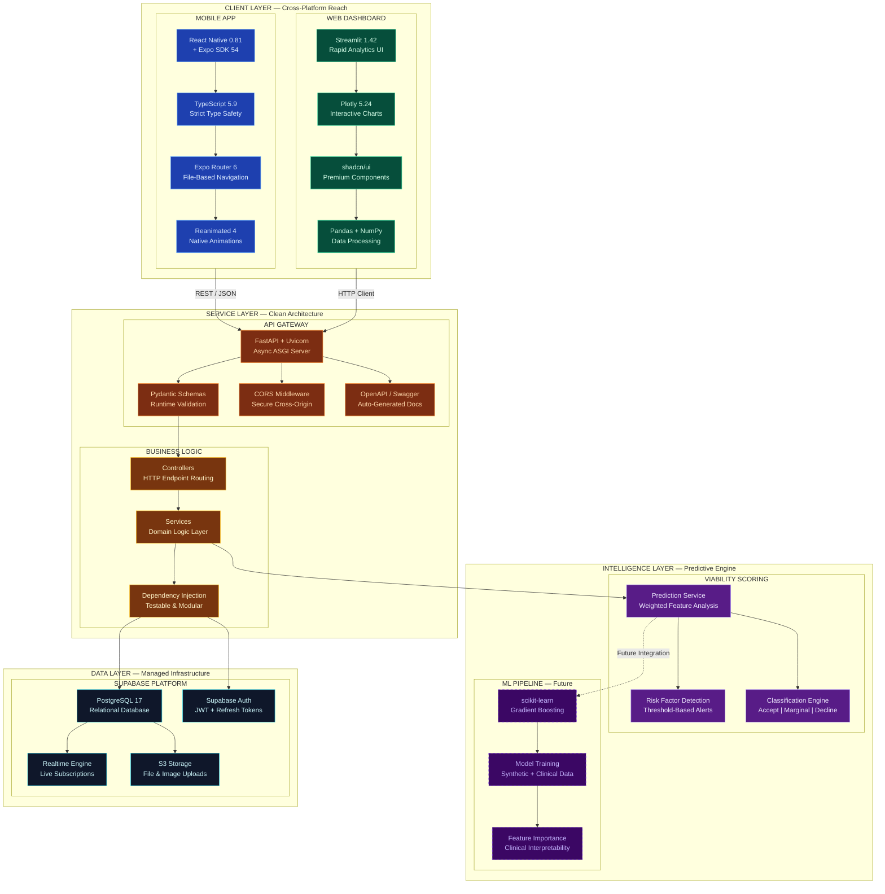
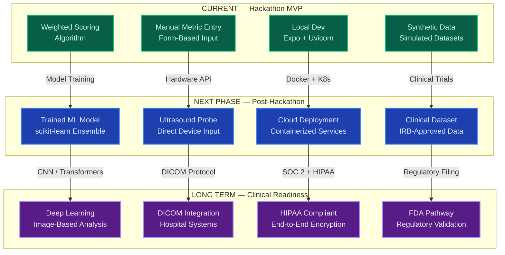
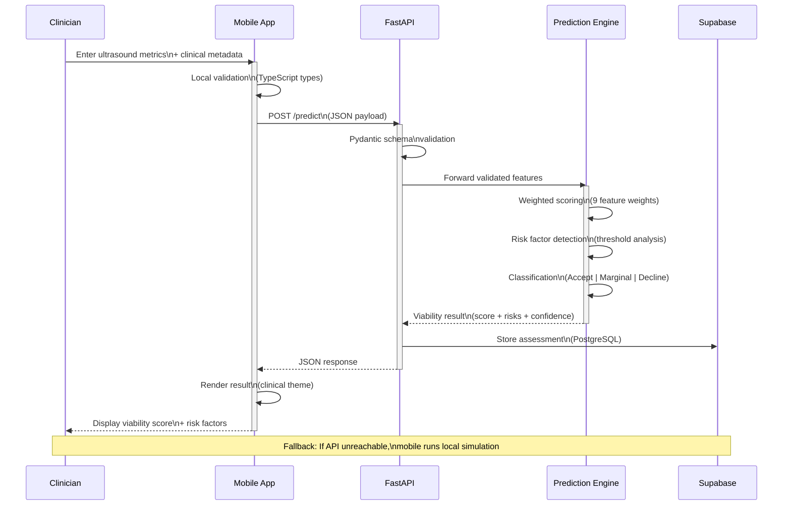

# UltraViab — Technical Architecture

> Real-time organ viability assessment powered by ultrasound analytics and machine learning

---

## System Architecture

---

## Platform Advantages

---

## Future-Proofing Roadmap

---

## Data Flow — Prediction Pipeline

---

## Why This Stack

| Principle | Implementation | Benefit |
|-----------|---------------|---------|
| **Lightweight** | Expo managed workflow, Streamlit single-file dashboard, FastAPI minimal footprint | Sub-second cold starts, minimal dependencies, rapid iteration |
| **Robust** | TypeScript + Pydantic dual validation, Supabase managed Postgres, JWT auth | Type-safe from client to database, zero data corruption surface |
| **Future-Proof** | Abstract service interfaces, dependency injection, modular ML pipeline | Swap scoring algorithm for trained model without touching API or UI |
| **Cross-Platform** | React Native (iOS/Android/Web), Streamlit (any browser) | One team covers every deployment surface |
| **Clinically Aware** | Dark/light clinical themes, offline fallback, touch-optimized forms | Built for real-world bedside use, not just demo day |
